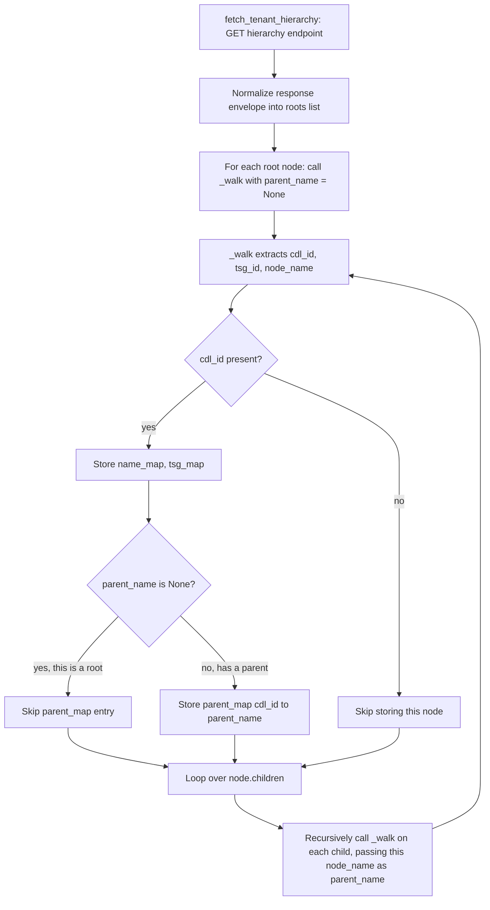
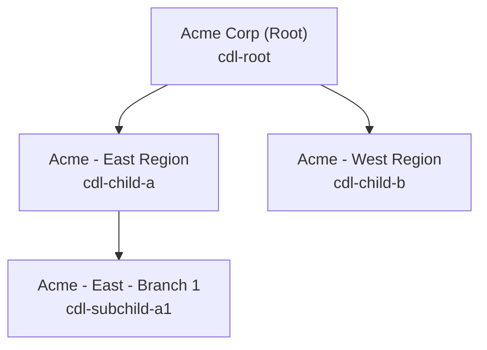
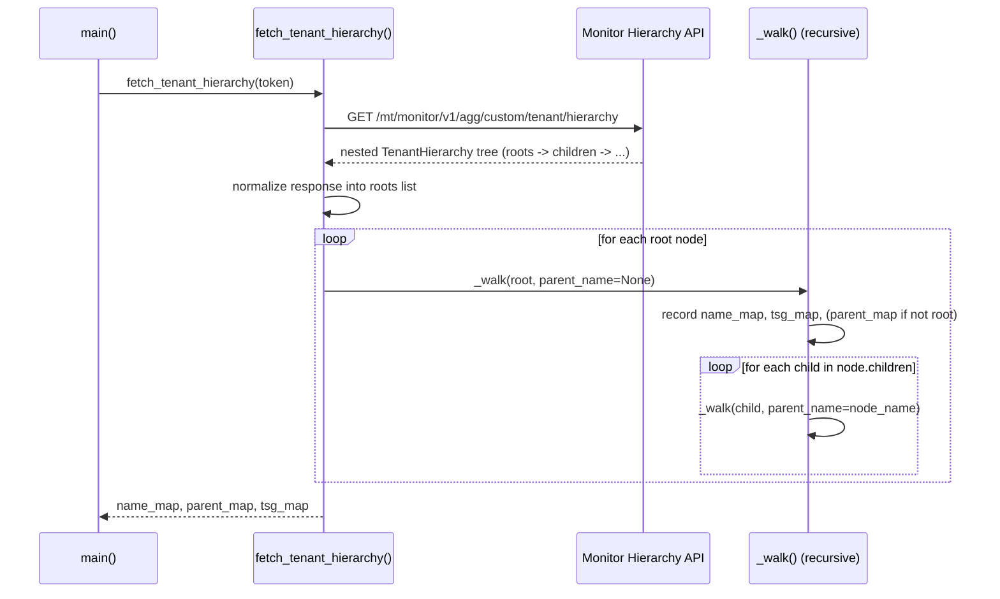

# TSG Hierarchy Traversal Logic

This document captures how `prisma_license_report.py` retrieves and walks the
Tenant Service Group (TSG) hierarchy — the parent → child → sub-child tree of
tenants and subtenants used throughout the rest of the report generation
pipeline.

Source: [`prisma_license_report.py`](../prisma_license_report.py:1)
Core function: [`fetch_tenant_hierarchy()`](../prisma_license_report.py:98)
Recursive walker: `_walk()` (closure defined at [`prisma_license_report.py:137`](../prisma_license_report.py:137))

---

## 1. Where the hierarchy comes from

The hierarchy is retrieved from a single API call — it is **not** built
client-side from a flat list. The API itself returns an already-nested tree.

```python
HIERARCHY_URL = f"{SASE_BASE_URL}/mt/monitor/v1/agg/custom/tenant/hierarchy"
```

([`prisma_license_report.py:63`](../prisma_license_report.py:63))

- **Endpoint:** `GET https://api.sase.paloaltonetworks.com/mt/monitor/v1/agg/custom/tenant/hierarchy`
- **Schema:** `TenantHierarchy` (per the pan.dev OpenAPI spec)
- **Why this endpoint and not the Tenancy API:** the Tenancy API
  (`/tenancy/v1/tenant_service_groups?hierarchy=true`) only returns TSG IDs.
  This Monitor API endpoint returns **both** the TSG Id (`id`) and the CDL
  Tenant Id (`cdlTenantId`) at every node, which is required to join hierarchy
  data against the license utilization APIs later in the script.

Each node in the returned tree has this shape (fields relevant to traversal):

| Field | Meaning |
|-------|---------|
| `id` | TSG Id of this node |
| `cdlTenantId` | CDL Tenant Id of this node (join key used elsewhere in the script) |
| `display_name` | Human-readable tenant/subtenant name |
| `children` | Array of child nodes, same shape, recursively nested (root TSG → child TSGs → sub-child TSGs, etc.) |

---

## 2. Response envelope normalization

Before the tree can be walked, the script normalizes the top-level response
shape, since the API may wrap the root node(s) differently depending on
context:

```python
body = resp.json()
if isinstance(body, list):
    roots = body
elif "items" in body:
    roots = body["items"]
elif "data" in body:
    roots = body["data"]
elif "cdlTenantId" in body or "id" in body:
    roots = [body]
else:
    roots = []
```

([`prisma_license_report.py:121-131`](../prisma_license_report.py:121))

This produces a `roots` list — one or more top-level (root) TSG nodes — that
is then fed into the recursive walker.

---

## 3. The recursive `_walk()` traversal

This is the heart of the parent/child/sub-child logic. It is a nested closure
inside `fetch_tenant_hierarchy()` so it can freely mutate the three
accumulator dictionaries defined in the enclosing scope.

```python
name_map:   dict[str, str] = {}
parent_map: dict[str, str] = {}
tsg_map:    dict[str, str] = {}   # cdlTenantId -> TSG id

def _walk(node: dict, parent_name: str | None) -> None:
    cdl_id    = str(node.get("cdlTenantId", ""))
    tsg_id    = str(node.get("id", ""))
    node_name = node.get("display_name", f"Unknown (TSG:{tsg_id})")
    if cdl_id:
        name_map[cdl_id]  = node_name
        tsg_map[cdl_id]   = tsg_id
        if parent_name is not None:
            parent_map[cdl_id] = parent_name
    for child in node.get("children", []):
        _walk(child, node_name)

for root in roots:
    _walk(root, None)
```

([`prisma_license_report.py:133-150`](../prisma_license_report.py:133))

### How the traversal works, step by step

1. **Entry point:** For every root node in `roots`, call `_walk(root, None)`.
   The `None` parent signals "this is a root TSG — it has no parent."
2. **Identify the current node:** Extract `cdlTenantId` (join key for later
   license APIs), `id` (TSG Id), and `display_name` (fallback:
   `"Unknown (TSG:<id>)"` if the API omits a name).
3. **Record the node:**
   - `name_map[cdl_id] = node_name` — lets any later code resolve a CDL
     Tenant Id back to a human-readable name.
   - `tsg_map[cdl_id] = tsg_id` — lets any later code resolve a CDL Tenant Id
     back to its TSG Id (needed for OAuth2 token scoping when querying
     child-TSG-scoped APIs).
   - `parent_map[cdl_id] = parent_name` — **only set if `parent_name is not
     None`**. This is what encodes the parent/child relationship: a node's
     entry in `parent_map` points to its immediate parent's *name* (not id).
     Root nodes are intentionally absent from `parent_map`, so
     `parent_map` doubles as an implicit "is this a root?" check
     (`cdl_id not in parent_map` ⇒ root).
4. **Recurse into children:** For every entry in `node["children"]`, call
   `_walk(child, node_name)` — passing the **current node's name** as the
   `parent_name` for the recursive call. This is what propagates the
   hierarchy level-by-level: a child node's parent is whoever called
   `_walk` on it, and that child's own children will, in turn, receive the
   child's name as their `parent_name`.
5. **Depth is unbounded:** Because `_walk` calls itself for each child, and
   each child's children call `_walk` again, the recursion naturally handles
   arbitrarily deep hierarchies — root → child → sub-child → sub-sub-child,
   etc. — without any hardcoded depth limit.

### Traversal flow diagram



### Parent → child → sub-child example

Given an API response shaped like:

```json
[
  {
    "id": "1000000001",
    "cdlTenantId": "cdl-root",
    "display_name": "Acme Corp (Root)",
    "children": [
      {
        "id": "1000000002",
        "cdlTenantId": "cdl-child-a",
        "display_name": "Acme - East Region",
        "children": [
          {
            "id": "1000000004",
            "cdlTenantId": "cdl-subchild-a1",
            "display_name": "Acme - East - Branch 1",
            "children": []
          }
        ]
      },
      {
        "id": "1000000003",
        "cdlTenantId": "cdl-child-b",
        "display_name": "Acme - West Region",
        "children": []
      }
    ]
  }
]
```

The traversal visits nodes in this order (depth-first, pre-order):



Resulting dictionaries:

| `cdl_id` | `name_map[cdl_id]` | `tsg_map[cdl_id]` | `parent_map[cdl_id]` |
|---|---|---|---|
| `cdl-root` | Acme Corp (Root) | 1000000001 | *(absent — root)* |
| `cdl-child-a` | Acme - East Region | 1000000002 | Acme Corp (Root) |
| `cdl-child-b` | Acme - West Region | 1000000003 | Acme Corp (Root) |
| `cdl-subchild-a1` | Acme - East - Branch 1 | 1000000004 | Acme - East Region |

Note how `cdl-subchild-a1`'s parent is `Acme - East Region` (its immediate
parent), not the root — each node only ever records its **direct** parent,
not the full ancestor chain. Reconstructing the full ancestor chain for any
node would require repeated lookups through `parent_map` (walking up name by
name) since only one level up is stored per node.

---

## 4. Function signature and return contract

```python
def fetch_tenant_hierarchy(token: str) -> tuple[dict, dict]:
```

Despite the type hint saying `tuple[dict, dict]` (a minor inconsistency in
the docstring/annotation), the function actually returns **three**
dictionaries:

```python
return name_map, parent_map, tsg_map
```

([`prisma_license_report.py:153`](../prisma_license_report.py:153))

| Returned value | Type | Keyed by | Maps to |
|---|---|---|---|
| `name_map` | `dict[str, str]` | CDL Tenant Id | Display name |
| `parent_map` | `dict[str, str]` | CDL Tenant Id | **Parent's** display name (absent for roots) |
| `tsg_map` | `dict[str, str]` | CDL Tenant Id | TSG Id |

---

## 5. How the hierarchy output is consumed downstream

The three dictionaries produced by the traversal feed directly into the rest
of the pipeline in [`main()`](../prisma_license_report.py:491):

```python
name_map, parent_map, tsg_map = fetch_tenant_hierarchy(token)
...
write_xlsx(util_records, name_map, parent_map, tsg_map, mu_map, output_file)
```

- **`name_map`** — used to resolve each license-utilization record's
  `sub_tenant_id` (CDL Tenant Id) into a human-readable tenant name for the
  Excel report ([`prisma_license_report.py:410`](../prisma_license_report.py:410)), and to label tenants during the
  MU user-count lookups ([`prisma_license_report.py:289`](../prisma_license_report.py:289)).
- **`tsg_map`** — used to display the TSG Id column in the Excel report
  ([`prisma_license_report.py:411`](../prisma_license_report.py:411)), and critically, to look up the **child TSG Id**
  needed to acquire a child-scoped OAuth2 token for the Insights 3.0 MU
  user-count API ([`prisma_license_report.py:513`](../prisma_license_report.py:513) → [`_get_child_token()`](../prisma_license_report.py:239)). The Insights API
  only returns real telemetry when the token is scoped to the specific child
  TSG rather than the root TSG.
- **`parent_map`** — accepted as a parameter by `write_xlsx()` but is
  **not currently used** to render a parent column or grouping in the Excel
  output (it is passed through but unused in the sheet-writing logic). It is
  available for future use (e.g., grouping subtenants under their parent in
  the report).

---

## 6. Summary of the traversal algorithm



**Key characteristics of the algorithm:**

- **Depth-first, pre-order recursion** — a node is recorded *before* its
  children are visited.
- **Single-level parent tracking** — each node stores only its immediate
  parent's name, not the full ancestor path.
- **CDL Tenant Id is the primary key** for all three output maps, because
  that is the identifier shared with the license utilization APIs
  (`sub_tenant_id`). TSG Id is tracked separately in `tsg_map` because it is
  needed for OAuth2 token scoping, not for joining license data.
- **No explicit depth limit** — root, child, and sub-child (and deeper) levels
  are all handled identically by the same recursive call.
- **Root detection is implicit** — a node is a root if and only if it does
  not appear as a key in `parent_map`.
